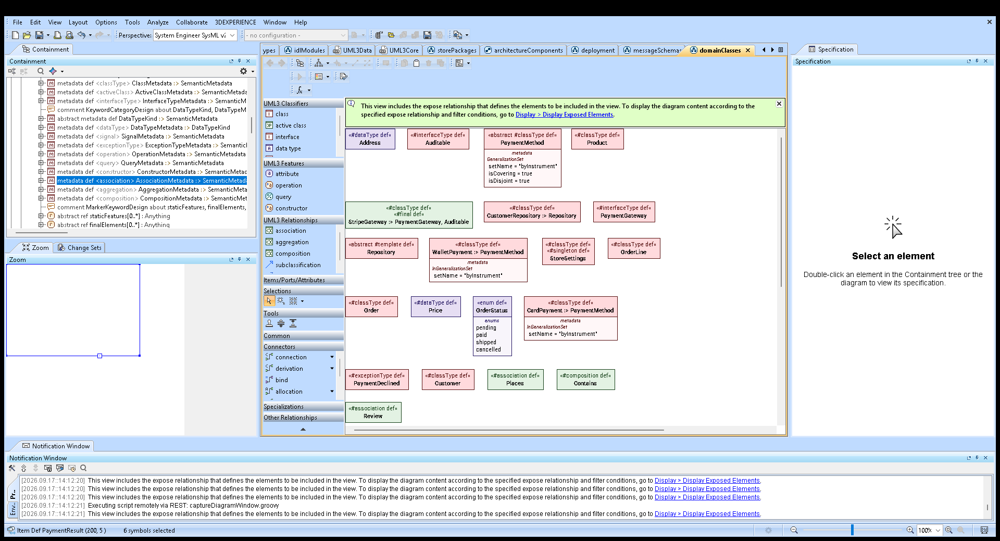
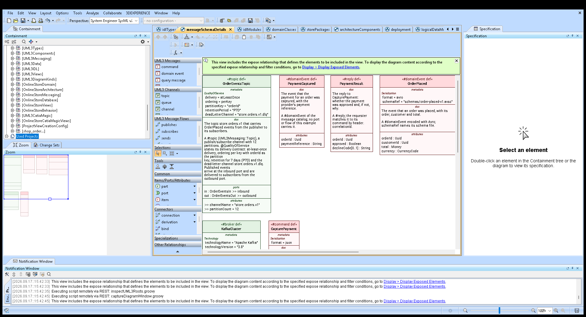

# UML3 in CATIA Magic: palettes and Create View commands

The UML3 libraries are tool neutral. This customization makes CATIA Magic (Cameo) draw UML3 models the way a UML
tool does: every UML3 diagram kind becomes a symbolic view with its own palette, and each palette button creates
an element that already carries its UML3 keyword. A class drawn from the palette is a `#classType item def`, not a
plain item definition that someone has to annotate afterwards.



A detail view shows the same model with its compartments and keeps the palette, here the message schemas with
the UML3 Message Flows buttons:



Files (`customization/catia-magic/`):

| File | Contents |
|---|---|
| `UML3CatiaMagic.sysml` | element templates, six palettes, ten view definitions (six compact, four detail), the UML3 detail style sheet, the UML3 Create View dialog |
| `UML3CatiaMagicActivation.sysml` | `ProjectViewCreationConfig`, which makes the UML3 Create View dialog the active one |
| `examples/OnlineStoreCatiaMagicViews.sysml` | the online store's ten views, typed by the UML3 view definitions |

It builds on the **3DS SysML Customization** library (`DS_Views`, `DS_UIComponents`), which CATIA Magic attaches to
every SysML v2 project, so nothing has to be installed for it.

## Installing it in a project

1. Load the UML3 libraries (`library/*.sysml`) in dependency order.
2. Load `customization/catia-magic/UML3CatiaMagic.sysml`.
3. Optionally load `UML3CatiaMagicActivation.sysml` to put the UML3 diagram kinds in the **Create View** menu. Only
   one Create View dialog can be active in a project, so this replaces the predefined one; remove the package to go
   back.
4. Create a view with **Create View** or in the Textual Editor, and open its diagram:

   ```sysml
   view domainClasses : UML3CatiaMagic::'UML3 Class Diagram' { expose OnlineStoreDomain::*; }
   ```

A diagram picks up its palette when it is created, so diagrams that already existed before the customization was
loaded keep the General View palette. Create the diagram after loading the customization (reloading the project has
the same effect). Load the customization only once per project: CATIA Magic drops view definitions whose names
collide, so a second copy silently disables every palette (E18).

## What the palettes contain

| View definition | Palette categories (buttons) |
|---|---|
| `UML3 Package Diagram` | UML3 Packages: package, layer, uses, dependency |
| `UML3 Class Diagram` | UML3 Classifiers: class, active class, interface, data type, signal, exception, enum def. UML3 Features: attribute, operation, query, constructor. UML3 Relationships: association, aggregation, composition, subclassification, and a menu with uses, realizes, calls, creates, traces, instantiates |
| `UML3 Component Diagram` | UML3 Components: component, service, subsystem, interface, service port def, provided port, required port. UML3 Wiring: assembly, delegation, realizes |
| `UML3 Deployment Diagram` | UML3 Deployment: node, device, execution environment, artifact. UML3 Deployment Links: communication path, deploy, manifest |
| `UML3 Entity Relationship Diagram` | UML3 Logical Data: entity, aggregate root, value object, relationship. UML3 Physical Data: table, database view, database, column, primary key, foreign key, maps to |
| `UML3 Message Schema View` | UML3 Messages: command, domain event, query message, reply, document message, message type. UML3 Channels: topic, queue, channel, broker. UML3 Message Flows: publishes, subscribes, sends, handles |
| `UML3 Class Detail Diagram`, `UML3 Deployment Detail Diagram`, `UML3 Entity Relationship Detail Diagram`, `UML3 Message Schema Detail View` | the palette of the matching compact view, on a view that shows its compartments (`UML3DetailStyleSheet`) |

Each palette keeps the vendor's Selections, Tools, Common, Items/Ports/Attributes, Connectors, Specializations and
Other Relationships categories and removes Actions, Other Actions, States, Cases and Requirements/Constraints,
which belong to other diagram kinds.

## How a button creates a UML3 element

A button's operation is `OperationFromTemplate`, which copies the single element owned by a template package:

```sysml
package classTemplate { #classType item def; }        // in UML3ElementTemplates
...
part classButton : Button :> abstractButtons {
    attribute :>> label = "class";
    perform action : OperationFromTemplate :>> operation {
        in ref = (UML3ElementTemplates::classTemplate meta KerML::Package).ownedElement;
    }
}
```

This is the mechanism CATIA Magic uses for its own derivation buttons. Consequences for the templates:

* A template package owns **exactly one** element and **no documentation**, because a doc would be a second owned
  element and would be copied into every created element (`tools/check_docs.py` exempts `*Template` packages).
* Template elements are **unnamed**, so the modeler names the copy. Unnamed definitions are legal SysML v2
  (`Identification` is optional, 8.2.2.1).
* A dependency or connector template owns placeholder ends as well, so its button selects the element it copies with
  `as SysML::Dependency`, `as SysML::ConnectionUsage`, `as SysML::AllocationUsage` or `as SysML::FlowUsage`. A
  connector that is not abstract must have two related features, which the placeholders provide; a flow needs
  *directed* ends, so its template owns two parts with `UML3Messaging` ports and flows between their message
  features (an undirected placeholder is not a related feature).

## The three rules a custom view definition must follow (E17)

1. **The vendor view definition comes first.** CATIA Magic builds its customization model downwards from
   `DS_Views::CoreViews::Visualization` and keeps a view definition only if its **first** general type is the one
   above it. `'UML3 Class Diagram' :> UML3Views::ClassDiagram, bsv` is silently ignored and its views fall back to
   the General View palette; `:> bsv, UML3Views::ClassDiagram` is registered.
2. **Exactly one rendering, which redefines the inherited ones.** `bsv` inherits `render asInterconnectionDiagram`
   from `Symbolic View`, and the UML3 view definitions bring their own rendering, so a combination has two
   renderers (`validateViewDefinitionOnlyOneViewRendering`). One owned rendering that redefines both keeps a single
   renderer:

   ```sysml
   render rendering compactRendering :>> asTreeDiagram, asInterconnectionDiagram;
   ```

   For the component view both inherited renderings are named `asInterconnectionDiagram`, so the redefinition names
   them by qualified name. (CATIA Magic also accepts an owned rendering next to the inherited ones, but the SysML
   OCL counts inherited memberships, so the redefinition is the portable form.)
3. **Detail views need a style sheet.** A palette requires a `Base Symbolic View` descendant, and such a view is
   always rendered, so it draws compact boxes; removing the rendering does not change that (E17). Compartments,
   however, are a *symbol style*, not a rendering: `UML3DetailStyleSheet` turns the documentation, attribute, item,
   action, part, port, end and parameter compartments back on, and a view definition applies it through the
   `explicitlyAppliedStyleSheets` feature of `Symbolic View`:

   ```sysml
   view def 'UML3 Class Detail Diagram' :> bsv, UML3Views::ClassDetailDiagram {
       part uml3DetailStyle : UML3DetailStyleSheet :>> explicitlyAppliedStyleSheets;
       part uml3ClassPalette : UML3ClassPalette :>> baseViewPalette;
   }
   ```

   The result is a detail view with a palette: E19 measured the same diagram content as the tool-neutral detail views
   (83,011 against 83,049 bytes of SVG for the store's class model). A detail view inherits only the rendering of
   `Symbolic View`, so it needs no rendering redefinition.

## Which keywords belong on which palette

The buttons are not chosen per tool. `library/UML3DiagramKinds.sysml` records, for each diagram kind, the keywords a
view shows and the keywords a palette creates, and each palette declares the kind it serves:

```sysml
part def UML3ClassPalette :> GeneralPalette {
    @PaletteForDiagramKind { kind = UML3DiagramKinds::classDiagram meta KerML::Type; }
    ...
}
```

`tools/check_diagram_kinds.py` then reports any button that the model does not list and any keyword of the kind that
has no button, so a keyword added to UML3 cannot be forgotten in the palette (issue I-35).

## Verification

`python tools/run_tests.py --cameo` covers the customization twice:

* Suite `catia-customization` (local): syntax, name resolution against `tests/catia-magic/ds-customization-stub.sysml`
  (a stub of the vendor library's names, so the checks run without CATIA Magic), documentation rules and design rules.
* Suite `cameo` with `--palettes`: 10 views (six compact, four detail) are checked; `tools/cameo-scripts/verifyPalettes.groovy` asks CATIA Magic's DSL service for
  each view's visualization, palette categories and buttons, resolves every templated button to its template element
  and that element's UML3 keyword, and reads the active Create View dialog. `tools/check_palettes.py` compares this
  with `tests/cameo/palette-expectations.json`; seven negative controls (an unregistered view definition, a missing
  category, a button that loses its keyword, a button that copies the wrong element kind, an unresolved template, a
  category that should have been removed, the wrong active dialog) all fail the check.

`tools/cameo-scripts/captureDiagramWindow.groovy` opens a view's diagram and writes a screenshot of the CATIA Magic
window, which is how the picture above was produced.
